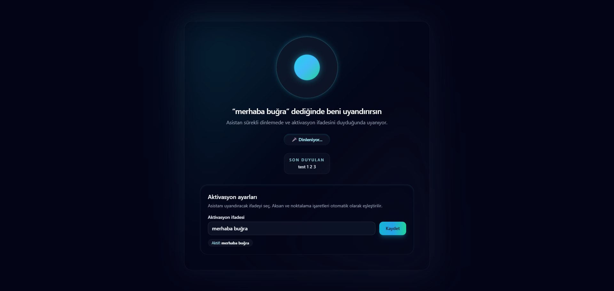
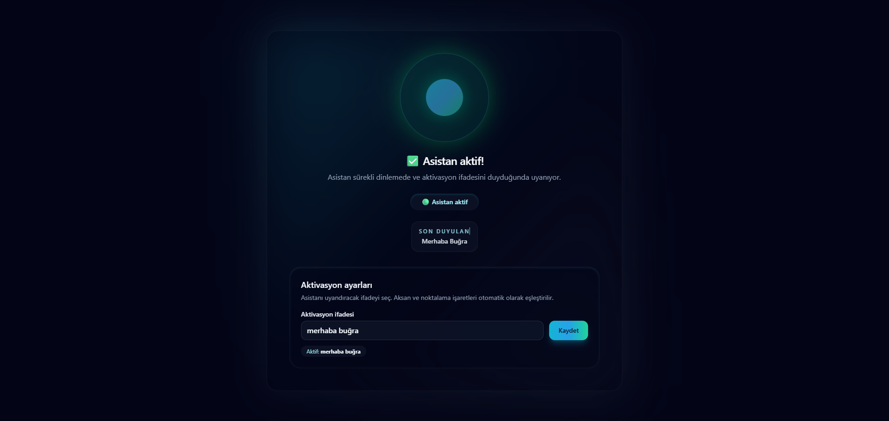

# Merhaba Asistan 👋

Türkçe sesli asistan prototipi. **React + Vite** üzerinde çalışır, **Web Speech API** ile sürekli mikrofon dinleme yapar, tetikleyici ifadeyi kullanıcıya bırakır ve aktivasyon olduğunda hem görsel animasyon hem de **Web Audio API** ile kısa bir uyarı sesi oynatır.

---

## 🚀 Özellikler

- **Sürekli Dinleme:** `tr-TR` dilinde çalışan Web Speech API, uygulama açık kaldığı sürece mikrofonu dinler.
- **Esnek Aktivasyon:** Arayüzdeki ayarlar bölümünden tetikleyici ifadeyi (örn. *“merhaba buğra”*, *“merhaba ayşe”*) dilediğin gibi güncelleyebilir, tarayıcı yeniden açıldığında da aynı ayarla devam edebilirsin.
- **Görsel Geri Bildirim:** Aktivasyon sırasında parlama/pulse animasyonu ve durum rozeti ile “Asistan aktif” bilgisi sunar.
- **Sesli Uyarı:** Aktivasyon gerçekleştiğinde kısa bir sinyal sesi üretir.
- **İzin Yönetimi:** Mikrofon izni verilmediğinde kullanıcıyı Türkçe mesajlarla yönlendirir, hata durumlarında otomatik yeniden deneme yapar.

---

## 📸 Ekran Görüntüleri

Pasif dinleme ve aktifleşmiş durumdan örnekler:




---

## 🧩 Teknolojiler

- [React 18](https://react.dev/)
- [Vite](https://vitejs.dev/)
- [TypeScript](https://www.typescriptlang.org/)
- [Tailwind CSS](https://tailwindcss.com/)
- Web Speech API & Web Audio API

---

## 🛠️ Kurulum

```bash
git clone https://github.com/alknbugra/hello-bugra-listener.git
cd hello-bugra-listener
npm install
```

---

## 🔧 Geliştirme

- **Yerel Sunucu:** `npm run dev`  
  Tarayıcıda gelen URL’yi aç (varsayılan `http://localhost:5173`). İlk açılışta mikrofon izni isteyecektir.

- **Üretim Derlemesi:** `npm run build`  
  Çıktılar `dist/` klasörüne yazılır.

- **Önizleme:** `npm run preview`

---

## 🎯 Kullanım İpuçları

1. Uygulamayı açıp mikrofon iznini ver.
2. Aktivasyon ayarlarından tetikleyici ifadeyi belirle (boş bırakırsan “merhaba buğra” varsayılanı kullanılır).
3. Seçtiğin ifadeyi söylediğinde animasyon, durum rozeti ve kısa bir ses ile asistanın devreye girdiğini görürsün. 3 saniye sonra dinleme moduna geri döner.
4. “Son duyulan” alanı tarayıcının ne anladığını gösterir; telaffuz sorunlarını takip etmek için kullanabilirsin.

---

## 📂 Proje Yapısı

```
hello-bugra-listener/
├── public/
│   └── vite.svg
├── src/
│   ├── App.tsx         # Ana bileşen – ses tanıma döngüsü, UI, ayarlar
│   ├── index.css       # Tailwind ve global stiller
│   └── main.tsx        # Giriş noktası
├── tailwind.config.js  # Tailwind tema özelleştirmeleri (animasyonlar, renkler)
├── vite.config.ts      # Vite + React eklentisi
└── package.json
```

---

## ✅ Yol Haritası (Fikirler)

- Aktivasyon sonrasında harici API çağrıları yapmak (örn. webhook tetikleme).
- Sesli geri bildirim (TTS) eklemek.
- Farklı diller için dinleme/aktivasyon profilleri tanımlamak.

---

## 📝 Lisans

Bu proje [MIT lisansı](LICENSE) ile yayınlanmaktadır.

Mutlu kodlamalar! ✨

