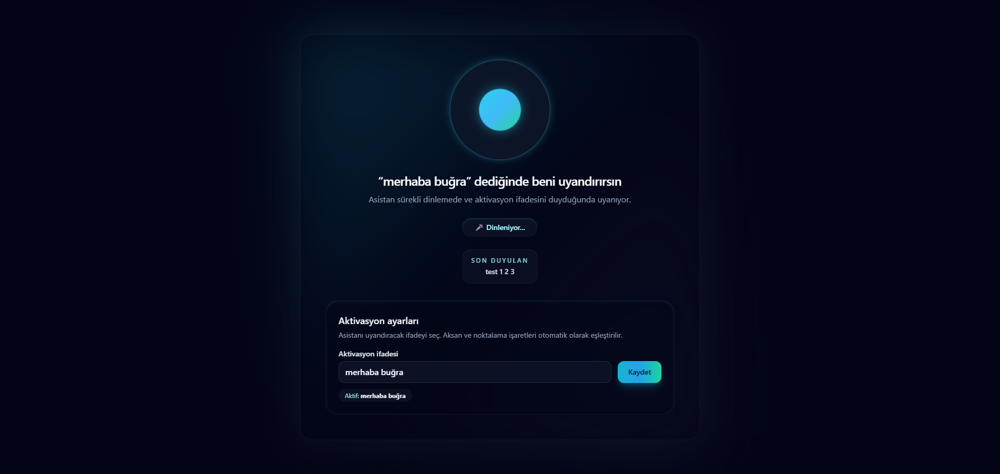
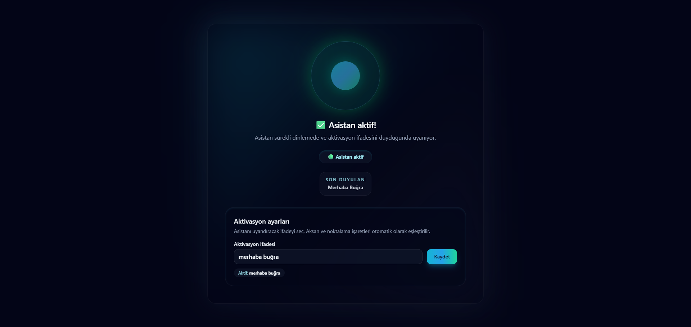

# Merhaba Asistan 👋

Türkçe sesli asistan prototipi. **React + Vite** üzerinde çalışır, **Web Speech API** ile sürekli mikrofon dinleme yapar, tetikleyici ifadeyi kullanıcıya bırakır ve aktivasyon olduğunda hem görsel animasyon hem de **Web Audio API** ile kısa bir uyarı sesi oynatır.

---

## 🚀 Özellikler

- **Sürekli Dinleme:** `tr-TR` dilinde çalışan Web Speech API, uygulama açık kaldığı sürece mikrofonu dinler.
- **Esnek Aktivasyon:** Arayüzdeki ayarlar bölümünden tetikleyici ifadeyi (örn. *“merhaba buğra”*, *“merhaba ayşe”*) dilediğin gibi güncelleyebilir, tarayıcı yeniden açıldığında da aynı ayarla devam edebilirsin.
- **Görsel Geri Bildirim:** Aktivasyon sırasında parlama/pulse animasyonu ve durum rozeti ile “Asistan aktif” bilgisi sunar.
- **Sesli Uyarı:** Aktivasyon gerçekleştiğinde kısa bir sinyal sesi üretir.
- **İzin Yönetimi:** Mikrofon izni verilmediğinde kullanıcıyı Türkçe mesajlarla yönlendirir, hata durumlarında otomatik yeniden deneme yapar.

---

## 📸 Ekran Görüntüleri

Pasif dinleme ve aktifleşmiş durumdan örnekler:




---

## 🧩 Teknolojiler

- [React 18](https://react.dev/)
- [Vite](https://vitejs.dev/)
- [TypeScript](https://www.typescriptlang.org/)
- [Tailwind CSS](https://tailwindcss.com/)
- Web Speech API & Web Audio API

---

## 📋 Sistem Gereksinimleri

Projeyi çalıştırabilmek için aşağıdaki yazılımların bilgisayarınızda kurulu olması gerekmektedir:

### 1. Node.js (Zorunlu)
- **Minimum versiyon:** Node.js 18.0 veya üzeri
- **Önerilen versiyon:** Node.js 20.x veya üzeri
- Node.js, JavaScript kodlarını çalıştırmak için gereklidir ve içinde npm (Node Package Manager) de gelir.

#### Node.js Nasıl Kurulur?

**Windows için:**
1. [Node.js resmi websitesine](https://nodejs.org/) gidin
2. "LTS" (Long Term Support) versiyonunu indirin (genellikle en üstte görünür)
3. İndirilen `.msi` dosyasını çalıştırın ve kurulum sihirbazını takip edin
4. Kurulum sırasında tüm varsayılan ayarları kabul edebilirsiniz
5. Kurulum tamamlandıktan sonra bilgisayarınızı yeniden başlatın

**Kurulumu Doğrulama:**
Kurulumun başarılı olup olmadığını kontrol etmek için:
- Windows'ta: `Windows Tuşu + R` tuşlarına basın, `cmd` yazıp Enter'a basın
- Açılan siyah ekranda şu komutları çalıştırın:
  ```bash
  node --version
  npm --version
  ```
- Her iki komut da bir versiyon numarası göstermelidir (örn: `v20.10.0` ve `10.2.3`)

### 2. Git (İndirme İçin Zorunlu)
Projeyi GitHub'dan indirmek için Git gereklidir.

**Git Nasıl Kurulur?**
1. [Git resmi websitesine](https://git-scm.com/download/win) gidin
2. Windows için Git'i indirin
3. Kurulum sihirbazını takip edin (varsayılan ayarlar yeterlidir)
4. Kurulum sonrası bilgisayarı yeniden başlatın

**Alternatif:** Git olmadan indirmek için GitHub'da proje sayfasında yeşil "Code" butonuna tıklayıp "Download ZIP" seçeneğini kullanabilirsiniz.

### 3. Modern Web Tarayıcı (Zorunlu)
Aşağıdaki tarayıcılardan birini kullanmalısınız (Web Speech API desteği için):
- **Chrome/Edge:** 33+ versiyon (Önerilen)
- **Firefox:** 44+ versiyon
- **Safari:** 14.1+ versiyon

---

## 🛠️ Detaylı Kurulum Adımları

### Adım 1: Projeyi İndirin

**Yöntem A - Git ile (Önerilen):**
1. İstediğiniz bir klasöre gidin (örneğin: `C:\Users\KullanıcıAdınız\Desktop`)
2. Klasörün içinde sağ tıklayın ve "Git Bash Here" veya "Open in Terminal" seçeneğini seçin
3. Aşağıdaki komutu çalıştırın:
   ```bash
   git clone https://github.com/alknbugra/hello-bugra-listener.git
   ```
4. Proje klasörüne girin:
   ```bash
   cd hello-bugra-listener
   ```

**Yöntem B - ZIP ile:**
1. GitHub'da proje sayfasında yeşil "Code" butonuna tıklayın
2. "Download ZIP" seçeneğini seçin
3. ZIP dosyasını indirip çıkarın
4. Çıkarılan klasöre gidin

### Adım 2: Bağımlılıkları Yükleyin

Proje klasörüne girdikten sonra, gerekli paketleri yüklemek için:

1. **Komut satırını açın:**
   - Windows'ta: Klasörün içindeyken adres çubuğuna `cmd` yazıp Enter'a basın
   - Veya sağ tıklayıp "Open in Terminal" / "Terminal'de Aç" seçeneğini kullanın

2. **Paketleri yükleyin:**
   ```bash
   npm install
   ```
   
   Bu işlem birkaç dakika sürebilir. Ekranda paket isimleri görünecektir. İşlem tamamlandığında `node_modules` adında bir klasör oluşacaktır.

3. **Hata mesajı alırsanız:**
   - Node.js'in düzgün kurulduğundan emin olun (`node --version` komutuyla kontrol edin)
   - İnternet bağlantınızı kontrol edin
   - `npm cache clean --force` komutunu çalıştırıp tekrar deneyin

### Adım 3: Uygulamayı Çalıştırın

1. Aynı komut satırında şu komutu çalıştırın:
   ```bash
   npm run dev
   ```

2. Birkaç saniye sonra şuna benzer bir mesaj göreceksiniz:
   ```
   VITE v7.2.2  ready in 500 ms
   
   ➜  Local:   http://localhost:5173/
   ➜  Network: use --host to expose
   ```

3. Tarayıcınızı açın ve şu adrese gidin:
   ```
   http://localhost:5173
   ```
   
   Not: Tarayıcı otomatik açılmazsa, manuel olarak yukarıdaki adresi adres çubuğuna yazın.

4. **İlk açılışta:** Tarayıcı mikrofon izni isteyecektir. "İzin Ver" veya "Allow" butonuna tıklayın.

---

## 🔧 Geliştirme Komutları

Proje klasöründe komut satırında kullanabileceğiniz komutlar:

### Yerel Geliştirme Sunucusu
```bash
npm run dev
```
- Uygulamayı geliştirme modunda başlatır
- Tarayıcıda `http://localhost:5173` adresinde açılır
- Kod değişikliklerinde otomatik olarak sayfayı yeniler
- Sunucuyu durdurmak için: Komut satırında `Ctrl + C` tuşlarına basın

### Üretim Derlemesi (Build)
```bash
npm run build
```
- Uygulamayı yayın için hazırlar
- Çıktılar `dist/` klasörüne yazılır
- Bu klasörü bir web sunucusuna yükleyerek uygulamayı yayınlayabilirsiniz

### Önizleme (Build Sonrası)
```bash
npm run build
npm run preview
```
- Önce build yapıp sonra önizleme yapar
- Yapılan değişikliklerin gerçek yayın versiyonunda nasıl görüneceğini test eder

---

## ⚠️ Sık Karşılaşılan Sorunlar ve Çözümleri

### ❌ "npm: komut bulunamadı" veya "npm is not recognized"

**Sorun:** Node.js düzgün kurulmamış veya sistem PATH'e eklenmemiş.

**Çözüm:**
1. Node.js'in kurulu olduğunu kontrol edin: `node --version`
2. Eğer node çalışıyorsa ama npm çalışmıyorsa, Node.js'i yeniden kurun
3. Bilgisayarı yeniden başlatın
4. Hala çalışmıyorsa, Node.js kurulumunda "Add to PATH" seçeneğinin işaretli olduğundan emin olun

### ❌ "npm ERR! code ENOTFOUND" veya Bağlantı Hatası

**Sorun:** İnternet bağlantısı sorunu veya npm kayıt defteri sorunu.

**Çözüm:**
1. İnternet bağlantınızı kontrol edin
2. Güvenlik duvarı veya proxy ayarlarınızı kontrol edin
3. npm önbelleğini temizleyin:
   ```bash
   npm cache clean --force
   ```
4. Tekrar deneyin: `npm install`

### ❌ "npm ERR! code ERESOLVE" veya Bağımlılık Çakışması

**Sorun:** Paket versiyonları arasında uyumsuzluk.

**Çözüm:**
1. `package-lock.json` dosyasını silin (varsa)
2. `node_modules` klasörünü silin (varsa)
3. Temiz bir kurulum yapın:
   ```bash
   npm install
   ```

### ❌ "Port 5173 is already in use"

**Sorun:** Başka bir uygulama aynı portu kullanıyor.

**Çözüm:**
1. Farklı bir port kullanmak için `vite.config.ts` dosyasındaki port numarasını değiştirin
2. Veya çalışan diğer uygulamayı durdurun
3. Windows'ta portu kullanan uygulamayı bulmak için:
   ```bash
   netstat -ano | findstr :5173
   ```

### ❌ Tarayıcıda "Mikrofon izni reddedildi" veya Ses Tanıma Çalışmıyor

**Sorun:** Tarayıcı mikrofon izni vermiyor.

**Çözüm:**
1. Tarayıcı ayarlarından mikrofon izinlerini kontrol edin:
   - Chrome: `chrome://settings/content/microphone`
   - Edge: `edge://settings/content/microphone`
2. `http://localhost:5173` adresi için izin verildiğinden emin olun
3. Sayfayı yenileyin (F5) ve izni tekrar verin
4. HTTPS kullanıyorsanız, bazı tarayıcılar HTTP üzerinde mikrofon izni vermeyebilir

### ❌ "Module not found" veya İçe Aktarma Hataları

**Sorun:** Paketler düzgün yüklenmemiş.

**Çözüm:**
1. `node_modules` klasörünü silin
2. `package-lock.json` dosyasını silin (varsa)
3. Yeniden yükleyin:
   ```bash
   npm install
   ```

### ❌ Node.js Versiyonu Çok Eski

**Sorun:** Node.js versiyonu 18'den düşük.

**Çözüm:**
1. Mevcut versiyonu kontrol edin: `node --version`
2. Node.js 18 veya üzerini [nodejs.org](https://nodejs.org/) adresinden indirip kurun
3. Kurulum sonrası bilgisayarı yeniden başlatın
4. Versiyonu tekrar kontrol edin

### ❌ Windows'ta "komut bulunamadı" hatası (Türkçe karakterler)

**Sorun:** Komut satırı kodlaması sorunu.

**Çözüm:**
1. PowerShell kullanmak yerine Command Prompt (cmd) kullanın
2. Veya PowerShell'de şu komutu çalıştırın:
   ```powershell
   chcp 65001
   ```

### 📞 Hala Sorun mu Yaşıyorsunuz?

Eğer yukarıdaki çözümler işe yaramazsa:
1. Projenin GitHub Issues bölümünde sorununuzu arayın
2. Yeni bir issue açın ve şu bilgileri ekleyin:
   - İşletim sistemi (Windows, macOS, Linux)
   - Node.js versiyonu (`node --version`)
   - npm versiyonu (`npm --version`)
   - Tam hata mesajı
   - Hangi adımda hata aldığınız

---

## 🎯 Kullanım İpuçları

1. Uygulamayı açıp mikrofon iznini ver.
2. Aktivasyon ayarlarından tetikleyici ifadeyi belirle (boş bırakırsan “merhaba buğra” varsayılanı kullanılır).
3. Seçtiğin ifadeyi söylediğinde animasyon, durum rozeti ve kısa bir ses ile asistanın devreye girdiğini görürsün. 3 saniye sonra dinleme moduna geri döner.
4. “Son duyulan” alanı tarayıcının ne anladığını gösterir; telaffuz sorunlarını takip etmek için kullanabilirsin.

---

## 📂 Proje Yapısı

```
hello-bugra-listener/
├── public/
│   └── vite.svg
├── src/
│   ├── App.tsx         # Ana bileşen – ses tanıma döngüsü, UI, ayarlar
│   ├── index.css       # Tailwind ve global stiller
│   └── main.tsx        # Giriş noktası
├── tailwind.config.js  # Tailwind tema özelleştirmeleri (animasyonlar, renkler)
├── vite.config.ts      # Vite + React eklentisi
└── package.json
```

---

## ✅ Yol Haritası (Fikirler)

- Aktivasyon sonrasında harici API çağrıları yapmak (örn. webhook tetikleme).
- Sesli geri bildirim (TTS) eklemek.
- Farklı diller için dinleme/aktivasyon profilleri tanımlamak.

---

## 📝 Lisans

Bu proje [MIT lisansı](LICENSE) ile yayınlanmaktadır.

Mutlu kodlamalar! ✨

